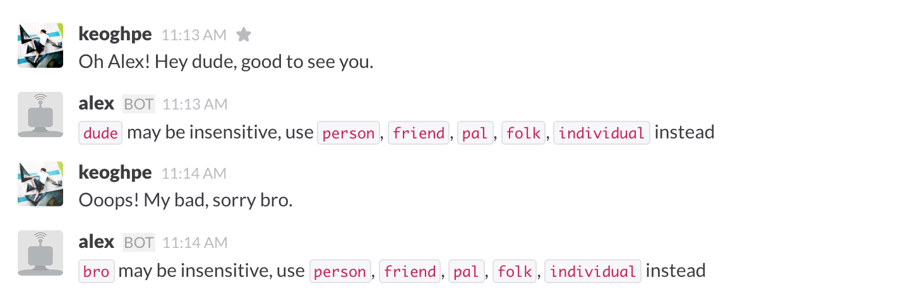

# Alex Integration For Slack

An [Alex](http://alexjs.com/) bot for slack that uses [slack-node-client](https://github.com/slackhq/node-slack-client).

##Deploy to Heroku

## Getting Started
1. Create a new [bot integration](https://my.slack.com/services/new/bot)
1. Follow the steps to deploy the bot to Heroku or run it locally

#### One-Click Heroku
Click this button:

#### Manual Heroku
1. Install [Heroku toolbelt](https://devcenter.heroku.com/articles/getting-started-with-nodejs#set-up)
1. Create a new bot integration (as above)
1. `heroku create`
1. `heroku config:set ALEX_TOKEN=[Your API token]`
1. `git push heroku master`

#### To Run Locally
1. `npm install`
1. `export ALEX_TOKEN="your-bot-key"`
1. `node index.js`
